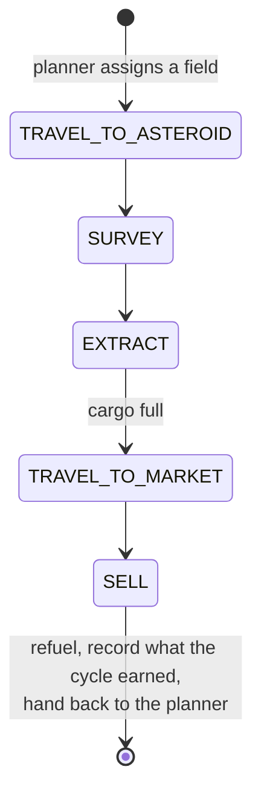
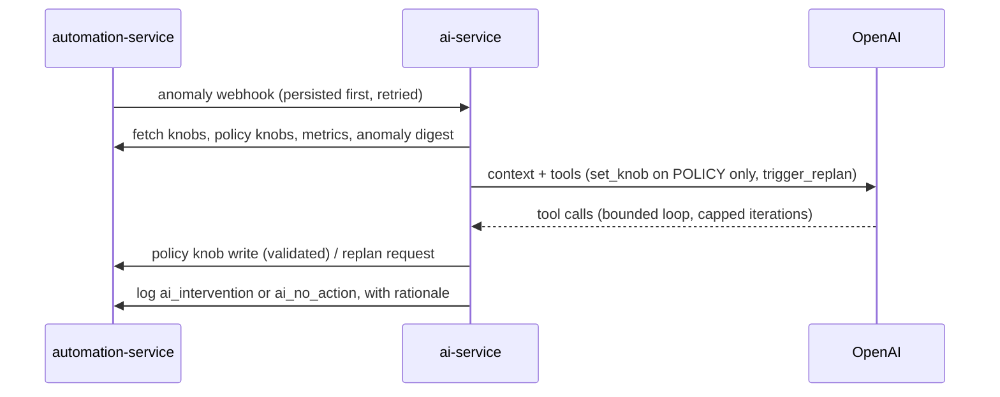

# Algorithms

How the autopilot thinks — enough to predict what it will do and to argue with
it, without reading the code. Everything here is deterministic and replayable
unless it's explicitly marked as the AI supervisor's territory.

Most of it lives in
[automation-service](https://github.com/V-M-Pioneer-Trading/automation-service);
the gateway section lives in
[st-gateway](https://github.com/V-M-Pioneer-Trading/st-gateway) and the
supervisor in [ai-service](https://github.com/V-M-Pioneer-Trading/ai-service).

- [The decision model on one page](#the-decision-model-on-one-page)
- [What the numbers come from](#what-the-numbers-come-from)
- [What the model does not capture](#what-the-model-does-not-capture)
- [The scheduler](#the-scheduler-one-atomic-action-per-tick)
- [Route cost](#route-cost-a-reachability-check-wearing-a-dijkstra-costume)
- [The work loops](#the-work-loops)
- [Fleet replan](#fleet-replan)
- [Anomaly detection](#anomaly-detection)
- [Shadow mode and replay](#shadow-mode-and-replay)
- [The AI supervisor](#the-ai-supervisor)
- [The gateway](#the-gateway-token-bucket-and-priority-queue)

---

## The decision model on one page

Whenever a ship has no target, the planner scores every option in one currency —
**expected credits per hour** — and takes the highest.

| Task | Score |
|---|---|
| Mine a field | `(credits this field earns per cycle × mine weight) / cycleHours` |
| Run a contract | `(expected profit × contract weight) / cycleHours` |
| Scout a market | `(credits per refresh × staleness) / cycleHours` |

where

```
cycleHours = distance / shipSpeed + fixedOverhead
staleness  = hoursSinceRefresh / stalenessThreshold
```

Two rules apply before any score matters:

- **Cash floor.** A candidate whose estimated cost would drop credits below the
  reserve floor is removed, not scored against. If everything reachable would
  breach it, the ship deliberately idles. Going broke on fuel is the classic
  SpaceTraders death spiral and it does not recover.
- **Reachability.** A target the ship cannot route to is not a candidate.

### Worked example

A ship sits at a market; two fields are in range. Speed 30, overhead 0.3h.

| | one way | round trip | credits/cycle | cycleHours | score |
|---|---|---|---|---|---|
| `BELT-NEAR` | 10 | 20 | 4,200 | 0.97 | **4,340 cr/h** |
| `BELT-FAR` | 90 | 180 | 11,800 | 6.3 | 1,873 cr/h |

`BELT-NEAR` wins despite being worth a third as much per trip, because it turns
around six times faster. If further cycles show `BELT-FAR` actually paying
60,000, its score becomes 9,524 cr/h and the planner switches — with no knob
touched by anyone.

**That switch is the entire point of the next section.** `credits/cycle` has to
differ between fields for it to be possible. If it were a single fleet-wide
constant it would cancel out of every comparison, and — since speed and overhead
are also constant across candidates — the whole model would reduce to
`argmin(distance)`. All the scoring machinery, all the knobs, and a graph search
would collectively be picking the nearest field.

That is exactly what this system used to do. It was fixed by measuring.

---

## What the numbers come from

The model needs four facts about the universe. Each is **measured from the
fleet's own history**, falling back to a knob only until there's data.

| Fact | Measured from | Falls back to |
|---|---|---|
| Credits per cycle, **per field** | Every completed cycle: what it sold, at which field | `mine.creditsPerCyclePrior` |
| Ship speed | Real flights — SpaceTraders reports both endpoints' coordinates and both timestamps | `travel.speedUnitsPerHourPrior` |
| Fixed overhead | Measured cycle time minus the travel that cycle's distance accounts for | `cycle.overheadHoursPrior` |
| Fuel per unit distance | Real refuel purchases against the distance they bought | `fuel.creditsPerUnitDistancePrior` |

Observations decay with a half-life (`observation.halfLifeHours`, default 6), so
recent evidence outweighs old without any single trip swinging the estimate.
Rates like speed are computed as summed distance over summed time rather than an
average of per-flight speeds — otherwise a 30-second hop would count as much as
a two-hour haul.

Overhead is derived as the *residual* — measured cycle time minus modelled
travel — rather than timed directly. That keeps the model self-consistent:
`cycleHours = distance/speed + overhead` is the same equation the planner scores
with, so predicted cycle time matches observed cycle time by construction.

Every planner decision logs which values it used **and whether each was measured
or assumed**. `GET /planner/model` shows the current state. A decision you can
explain is worth more than one you can only justify.

### Knob classes

Not every number is the same kind of thing, and conflating them is how a tuning
system becomes untrustworthy:

- **`model`** — a claim about how the universe behaves. Measured. Editing one
  doesn't change reality, it changes what the planner *believes*, which is how a
  fleet ends up confidently flying to the wrong asteroid.
- **`policy`** — a preference with no true value. Favour mining or contracts?
  How much cash to keep back? Nothing can measure these.
- **`alert`** — the thresholds that decide when something is wrong.

The AI supervisor may write **`policy` only**. The `alert` fence is the sharp
one: an agent that can widen its own alarm thresholds will eventually resolve
"profit dropped" by deciding profit drops are fine.

---

## What the model does not capture

Worth being explicit, because "expected credits per hour" sounds more complete
than it is.

- **Which goods a field yields, or what they're worth.** Revenue is learned
  empirically per field — the planner knows a field *has* paid well, not why, and
  can't anticipate a change in what it produces.
- **Market depth and price impact.** Selling repeatedly into the same market
  moves the price. The model treats each cycle's revenue as a draw from a stable
  distribution, so it discovers a market it has saturated only after the fact,
  through falling observations.
- **Opportunity cost of a ship already in flight.** Scoring happens when a ship
  is idle. A better target appearing mid-cycle is simply not considered until
  the cycle ends — deliberate, since tasks are short and preemption is worse.
- **Competition.** Other agents mine the same fields and sell into the same
  markets. They appear only as noise in the observations.
- **Contract deadlines.** A contract is scored on profit per hour, not on how
  close it is to expiring.
- **Anything about a field never visited.** It inherits the fleet-wide average,
  which is a guess dressed as an estimate — an unvisited field is uncertain, and
  the model carries no uncertainty, only a mean.
- **Multi-good contracts**, and any target outside the ship's current system.

---

## The scheduler: one atomic action per tick

Everything runs on a single fixed-interval tick (default 5 seconds). Each tick
performs **at most one atomic action** — dispatch one command, resolve one
elapsed wait, or ask the planner for one assignment. Never two.

That granularity is a safety property, not an optimisation: it's what makes
*pause* take effect cleanly between actions instead of killing something
mid-flight. Pause lets an already-dispatched wait finish and be recorded, then
stops dispatching. Abort stops the timer immediately; an action already in
flight can't be un-sent, so its result is discarded and marked with a discard
event rather than silently taking effect after the operator said stop.

## Route cost: a reachability check wearing a Dijkstra costume

Travel cost is computed with a fuel-aware shortest-path search over the system's
waypoint graph. It's worth knowing what that actually buys, because the name
oversells it.

In SpaceTraders every waypoint is directly reachable from every other, and legs
cost Euclidean distance. The triangle inequality therefore guarantees the direct
hop is always the *shortest* route — a detour is never cheaper. So the search is
really answering **"can the ship get there, and if it needs refuelling stops,
what do they cost?"** It only does interesting work when the direct hop exceeds
the tank.

Two constraints: a leg longer than the tank being flown on is infeasible, and an
intermediate stop must have a fuel station (in practice, a marketplace). The
final destination is the one place it's fine to arrive dry. Initial fuel and
tank capacity are tracked separately, because the first leg flies on what's in
the tank while every leg after a refuelling stop flies on a full one.

*(The original design called for BFS; it shipped as Dijkstra because legs have
real distances rather than uniform costs.)*

---

## The work loops

Each ship runs one task at a time as a resumable state machine, persisted after
every phase change.

### Mining



The sell leg queries every in-system marketplace and picks the best price for
what's in the hold. A survey can yield several goods, so `SELL` sells what the
current market buys and re-shops for a market that takes the rest.

**The last step is what closes the loop**: the cycle's takings, duration and
distance become one observation against the field it was earned at, and the next
decision is that much better informed.

### Contracts

Contracts compete with mining in the same credits/hour currency. Right before
every assignment, unseen contracts are discovered and evaluated deterministically
— cheapest in-system market selling the deliverable, fuel-aware route through it
to the destination, `profit = payment − procurement − travel`. Anything clearing
the minimum-profit threshold is accepted on the spot.

Evaluation is deliberately **inline rather than a background job**. An earlier
draft used a background scheduler and it raced the planner: a freshly discovered,
higher-scoring contract could lose to mining purely for being mid-evaluation.

An accepted contract runs its own state machine (travel → purchase → travel →
deliver → fulfill), sharing the mining FSM's travel helpers. A contract task
that fails out releases the contract back to the pool rather than leaving it
claimed by a ship that gave up.

### Scouting

Market prices age, and a planner deciding on stale prices decides blind.
Scouting makes "go refresh that market" a first-class task in the same units.
Value grows linearly with staleness and drops to zero on refresh, so the planner
rotates through markets on its own — no cooldown or round-robin needed. A market
never seen is treated as ten thresholds stale: high priority, but finite.

Scouting's value is the one term that **can't** be measured. The cost of stale
prices is the bad trades you never make and therefore never observe. So
`scout.creditsPerRefresh` is an honest policy judgment rather than a measurement,
and it's both the price and the weight — a separate weight would only multiply
against it.

### When a target keeps failing

After a configured number of consecutive failures the ship is reset for a fresh
assignment — **unless it's holding cargo it hasn't disposed of**, in which case
it keeps retrying rather than stranding it.

---

## Fleet replan

Assignment normally happens ship-by-ship as ships free up. A **replan**
re-scores every *idle* ship when something changes that could change the answer:
any knob write, any new anomaly, a manual request, or a periodic fallback. All
triggers share one debounce clock, so a storm of knob changes coalesces into a
single replan.

**Running work is never preempted.** A replan only touches ships that are idle
or between cycles; tasks are kept short and bounded so a stale assignment costs
minutes at most. Abort is the only interrupt.

---

## Anomaly detection

Five deterministic checks run on a fixed interval, independent of whether the
autopilot is armed — a broken ship stays worth reporting while an operator
investigates. Every threshold is a bounded `alert` knob.

| Check | Fires when |
|---|---|
| `ship_idle` | A ship's task hasn't changed phase in N minutes (while armed and live) |
| `earnings_stalled` | The hourly rate collapsed against its own history, **or** credits show no net increase across a window |
| `consecutive_failures` | One ship accumulates N consecutive failures |
| `error_rate` | The error fraction of recent mining events exceeds a threshold |
| `market_stale` | A market in active use hasn't been repriced in N minutes |

`earnings_stalled` merges what used to be two checks. They measured one thing
from two angles — a fleet that stops earning trips both — so firing separately
made the digest look busier than the fleet was. Both conditions stay separately
tunable and are named in `detail.reasons`.

Each anomaly is persisted first, then delivered to ai-service as a webhook with
retries and backoff. A dedupe key suppresses the same condition from re-firing
every tick while it stays open.

---

## Shadow mode and replay

Two different ways to find out what the autopilot would do without letting it.

**Shadow mode** runs the full scoring cycle on the live schedule and logs every
would-be decision, but never writes task state and never dispatches. It's a
continuous preview, meant to build trust before the first unattended live run.
Switching between shadow and live always requires an explicit re-arm, so nobody
drifts from dry run into live dispatch by accident.

**Replay** goes the other direction — backwards over decisions already made:

```bash
npm run replay -- --since 6h --set mine.taskWeight=2
```

Every planner decision logs the inputs it used: each candidate's distance, the
calibrated model, every knob value. Since scoring is pure arithmetic over
exactly those inputs, past decisions can be re-scored under different knobs with
no network access at all. The tool reports how many would have gone differently.
**Zero flips means the change does nothing** — worth knowing before attributing
a later swing in profit to it.

It replays the choice between asteroid fields. It doesn't re-derive whether a
contract or scout would have won outright, because those scores were frozen from
market state at the time and can't be honestly recomputed from the log.

---

## The AI supervisor

ai-service is the one non-deterministic component, and it's fenced accordingly:



The model gets two tools: `set_knob` and `trigger_replan`. Three things
constrain `set_knob`, in order:

1. Its `name` enum is built from the **policy knobs only**, so the model cannot
   name a model or alert knob.
2. If it names one anyway, ai-service refuses locally — the request never
   leaves the process.
3. automation-service validates bounds again on the write itself.

The model still *sees* every knob, because understanding the fleet's
configuration is the job; it just can't act on most of it. Faced with a
threshold it believes is mistuned, the honest move — saying so in its rationale
for an operator to read — is the only one available to it.

Every run ends by logging its outcome and written rationale into
automation-service's event log, in a namespaced `ai_*` event type the event API
reserves for external supervisors. The AI can record its own decisions but can
never spoof a lifecycle or planner event.

An hourly review re-pulls the digest and runs the supervisor for anything a lost
webhook missed; duplicate deliveries are deduped by id. **If ai-service is down
entirely, nothing happens** — which is the point. The fleet keeps operating on
its current knobs.

---

## The gateway: token bucket and priority queue

Every SpaceTraders call from every service funnels through st-gateway's single
token bucket (default ~2 requests/second). Two FIFO queues share the budget:
**interactive** (UI-originated) and **background** (everything else), with
interactive always drained first — the dashboard stays responsive while the
autopilot saturates the rest.

Classification is derived from a **verified identity**, never declared
(auth-design.md decision 2). The caller's `Authorization` — a Clerk session —
is forwarded verbatim by agent/navigation/fleet-service, and st-gateway checks
its signature itself: a human session (`sub` starting `user_`) earns the
interactive lane; a machine token (automation-service's M2M, `sub` `mch_…`),
no token, or a token that fails verification all land in `background`. There
is no `X-Priority` header any more — an earlier design let callers declare
their class, which meant anything could promote itself by sending a string.

The one way to break this silently is a backend that verifies the session and
then does *not* forward it upstream: every call from it degrades to background
with no error. **Any new backend that calls st-gateway must relay the inbound
`Authorization` header unchanged.**

Retries are centralised and deliberately asymmetric: a 429 is always safe to
retry, because a rate-limited request never executed upstream. A 5xx or network
failure is retried only for side-effect-free methods — a POST that may already
have executed a purchase is never replayed. `Retry-After` is honoured, backoff
is exponential and capped, and non-retryable statuses pass through unchanged.
Queue depth and wait latency per class are exposed on a metrics endpoint, so
it's visible when the rate budget is the bottleneck.
