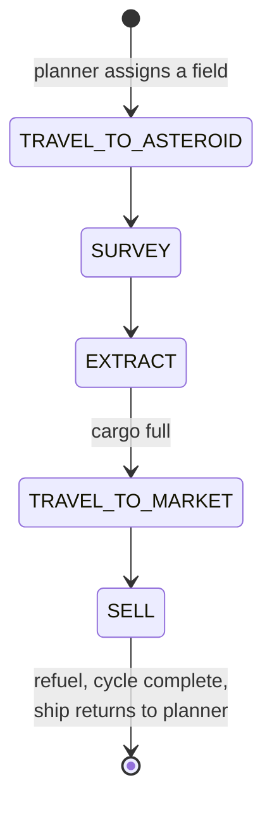
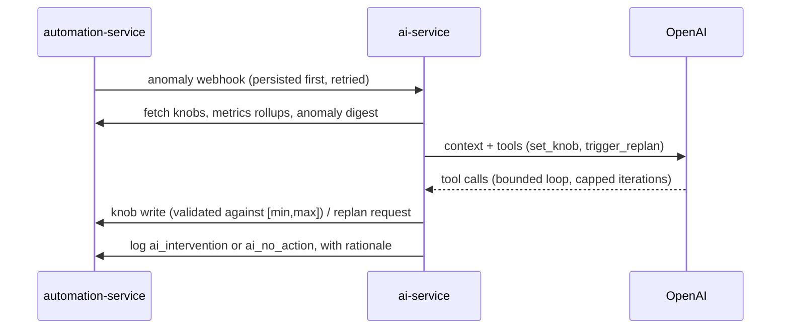

# Algorithms

How the autopilot actually thinks. This is an overview for humans — enough to
understand and predict the system's behavior, not a substitute for the code.
Everything here is deterministic and replayable from the event log unless
explicitly marked as the AI supervisor's territory.

Most of what follows lives in
[automation-service](https://github.com/V-M-Pioneer-Trading/automation-service);
the gateway section lives in
[st-gateway](https://github.com/V-M-Pioneer-Trading/st-gateway) and the
supervisor in [ai-service](https://github.com/V-M-Pioneer-Trading/ai-service).

## The scheduler: one atomic action per tick

Everything the autopilot does runs on a single fixed-interval scheduler tick
(default every 5 seconds). Each tick performs **at most one atomic action** —
dispatch one command, resolve one elapsed wait (a transit or a cooldown), or
ask the planner for one assignment — never more than one.

That granularity is a safety property, not an optimization: it's what makes
*pause* take effect cleanly between actions instead of killing something
mid-flight. Pause lets an already-dispatched wait finish and be recorded, then
stops dispatching new actions. Abort stops the timer immediately; an action
already in flight can't be un-sent, so its result is discarded and marked with
a discard event rather than silently taking effect after the operator said
stop.

## The planner: everything scores in credits per hour

Whenever a ship has no target — brand new, just finished a cycle, or just
failed out of a target — the next tick asks the planner for an assignment. The
planner scores every candidate task in one comparable currency, **expected
credits per hour**, and the highest score wins:

- **Mining a field**: `(expectedCreditsPerCycle × mineWeight) / cycleHours`,
  where cycle time comes from round-trip travel distance at an assumed speed
  plus a fixed overhead for survey/extract/cooldown/sell.
- **Working a contract**: `(expectedProfit × contractWeight) / cycleHours`,
  with profit and cycle time frozen at contract-evaluation time.
- **Scouting a market**: `(valuePerRefresh × stalenessFactor × scoutWeight) / cycleHours`
  — see the scouting section for how staleness works.

Every constant in those formulas is a **knob**: a configuration value stored
with a default and declared `[min, max]` bounds, editable through an API by
the operator's UI and by the AI supervisor alike. The weights are exactly the
levers the AI gets to pull.

Two guard rails apply before any assignment:

- **Credit reserve floor**: the planner never assigns work whose estimated
  cost (fuel for mining, procurement + travel for contracts) would drop the
  agent's credits below a configured floor. If everything reachable would
  breach it, the ship idles — deliberately, because going broke on fuel is the
  classic SpaceTraders death spiral.
- **Reachability**: a target you can't route to scores nothing (next section).

Every assignment decision logs every candidate considered — distance,
reachability, score, reserve-floor check, and the knob values used — so any
decision can be replayed exactly.

## Route cost: fuel-aware Dijkstra

Travel cost between waypoints is computed with Dijkstra's shortest-path search
over the system's waypoint graph, with two fuel constraints: a single leg
longer than the ship's fuel capacity is infeasible, and a multi-leg route may
only pass *through* waypoints where the ship can refuel (in practice, ones
with a marketplace) — the final destination is the only allowed dry stop.
Unreachable targets are simply not candidates.

(The original design called for BFS; the implementation shipped as Dijkstra
because legs have real distances, not uniform costs.)

## The mining loop

The proven money-maker, run as a resumable finite state machine:

The sell leg queries every marketplace in the system and picks the best price
for what was extracted, then refuels before handing the ship back to the
planner. Per-ship progress persists to Postgres after every phase change, so a
restart plus re-arm resumes from the last completed phase instead of starting
over.

**Failure-driven reassignment**: if working a target keeps failing (three
consecutive tick errors by default), the ship is reset for a fresh planner
assignment — *unless* it's holding unsold cargo from that target, in which
case it keeps retrying rather than stranding the cargo.

## The contract loop

Contracts (the game's delivery quests) compete with mining in the same
credits/hour currency. Right before every assignment decision, the scheduler
synchronously discovers any unseen contracts and evaluates each one
deterministically: find the cheapest in-system market selling the deliverable
good, compute the fuel-aware route through that market to the delivery
destination, and derive `expectedProfit = payment − procurement − travel`.
Contracts clearing a minimum-profit threshold are accepted on the spot; the
rest are declined. Evaluation is deliberately inline rather than a background
job — an earlier draft ran it in the background and raced the scheduler, so a
freshly discovered, higher-scoring contract could lose to mining just by
being mid-evaluation.

An accepted contract runs its own state machine (travel to market → purchase →
travel to destination → deliver → fulfill), sharing the mining FSM's travel
helpers and its one-action-per-tick discipline. A contract task that fails out
releases the contract back to the pool rather than leaving it claimed by a
ship that gave up.

## The scouting loop

Market prices age, and a planner deciding on stale prices decides blind.
Scouting makes "go refresh that market's data" a first-class task competing in
the same credits/hour units: each market's score grows linearly with how long
it's gone unrefreshed relative to a staleness threshold, and never-seen
markets get a large first-visit bonus. Refreshing a market resets its score to
zero, so the planner naturally rotates through markets as they age — no
explicit cooldown needed. Scouting is opt-in: its value knob defaults to zero,
so it wins no assignments until an operator prices it.

## Fleet replan

Assignment normally happens ship-by-ship as ships free up. A **replan**
re-scores every *idle* ship's options when something changes that could change
the answer: any knob write, any new anomaly, a manual API request, or a
5-minute periodic fallback. All triggers share one debounce clock (30 seconds
by default), so a storm of knob changes coalesces into a single replan.

The critical rule: **running work is never preempted**. A replan only touches
ships that are idle or between cycles; tasks are kept short and bounded (one
mining round-trip, one delivery leg) so a stale assignment costs minutes at
most. Abort is the only interrupt.

## Anomaly detection

Six deterministic health checks run on a fixed interval, independent of
whether the autopilot is armed — a broken ship stays worth reporting while the
operator investigates. Every threshold is a bounded knob:

| Check | Fires when |
|---|---|
| `ship_idle` | A mining ship's task hasn't changed phase in N minutes (while armed and live) |
| `profit_drop` | Credits/hour falls below a fraction of the trailing 6-hour average |
| `consecutive_failures` | One ship accumulates N consecutive task failures |
| `error_rate` | The error fraction of recent mining events exceeds a threshold |
| `credits_flat` | Agent credits show no net increase across a trailing window |
| `market_stale` | A market in active use hasn't been repriced in N minutes |

Each anomaly is persisted first, then delivered to ai-service as a webhook
with up to three retries and exponential backoff. A dedupe key suppresses the
same underlying condition from re-firing every tick while it stays open.

## Metrics rollups

A background scheduler persists one metrics rollup per minute — credits/hour,
units extracted, and error rate for the window since the previous rollup. On
restart it resumes from the last persisted window's end, so there are no gaps
and no double counting. A bounded context endpoint returns recent rollups plus
recent events in one response, shaped to fit an AI context window; both the AI
supervisor and the MCP server read it.

## Shadow mode

Arming in shadow mode runs the full planner scoring cycle on the live schedule
and logs every would-be decision — but never writes task state and never
dispatches a ship action. It's a continuous, safe preview of what live mode
would do, meant to build trust before the first unattended live run. Switching
between shadow and live always requires an explicit re-arm, so an operator
can't drift from dry-run into live dispatch by accident.

## The AI supervisor

ai-service is the one non-deterministic component, and it is fenced
accordingly:

The model gets two tools only: `set_knob` — refused locally if the value falls
outside the knob's declared bounds or the knob doesn't exist — and
`trigger_replan`. The loop is capped at a fixed number of tool round-trips.
Every run ends by logging its outcome and a written rationale into
automation-service's event log, in a namespaced `ai_*` event type that the
event API reserves for external supervisors, so the AI can record its own
decisions but can never spoof a lifecycle or planner event.

An hourly review re-pulls the anomaly digest and runs the supervisor for
anything a lost webhook missed. Duplicate deliveries of the same anomaly are
deduped by id. If ai-service is down entirely, nothing happens — which is the
point: the fleet keeps operating on its current knob values.

## The gateway: token bucket and priority queue

Every SpaceTraders call from every service funnels through st-gateway's single
token bucket (default ~2 requests/second). Two FIFO queues share the budget:
**interactive** (requests tagged as UI-originated) and **background**
(everything else), with interactive always drained first — the dashboard stays
responsive while the autopilot saturates the remaining budget.

Retries are centralized and deliberately asymmetric: a 429 is always safe to
retry, because a rate-limited request was never executed upstream. A 5xx or
network failure is retried only for side-effect-free methods — a POST that may
already have executed a purchase is never replayed. `Retry-After` headers are
honored, backoff is exponential and capped, and non-retryable statuses pass
through unchanged. Queue depth and wait latency per class are exposed on a
metrics endpoint, so it's visible when the rate budget is the bottleneck.
