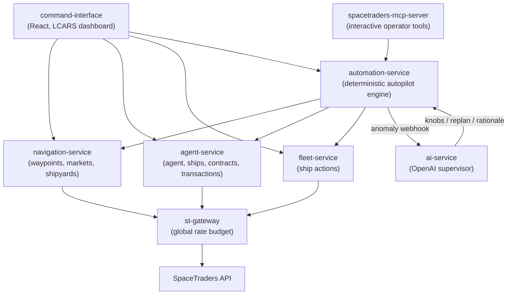

# Architecture

This document describes how the SpaceTraders fleet system is put together and why
it looks the way it does. It assumes no prior knowledge of the codebase. For how
the individual algorithms work, see [algorithms.md](algorithms.md); for running
and deploying the system, see [operations.md](operations.md).

## What this system is

[SpaceTraders](https://spacetraders.io/) is a programming game played entirely
through a REST API: you command a fleet of spaceships that mine asteroids, trade
goods, and fulfill contracts for credits. This project is an enterprise built on
top of that API — first as a manually-operated dashboard, then as an
increasingly autonomous operation. The end state is a single "autopilot" switch:
flip it, walk away, and the fleet keeps earning on its own.

The guiding principle throughout: **the core is deterministic, and AI sits on
top as a monitor**. Coded algorithms handle routing, pricing, and scheduling. An
AI supervisor watches health metrics and nudges parameters when things drift —
but it is never in the hot loop, and the fleet keeps running when it's down.

## Why there are eight services

Because the split is the exercise, not because the workload needs it.

One ship mining one system at two requests per second is comfortably a single
process — probably a single file. Eight services, four datastores and a rate
gateway exist here to work through service boundaries, a shared global rate
budget, per-service persistence choices, and an AI component fenced off from the
deterministic core. Those are the problems worth practising on, and they're only
real when the boundaries are real.

The cost is honest: a change that touches routing and dispatch touches two
repos, and local development needs `docker compose`. That's the trade being
made deliberately, and it's the right one for what this project is for. It would
be the wrong one if the goal were simply to mine efficiently.

Where the same reasoning pointed the other way, it was followed. Contract
evaluation is an inline function call rather than the background scheduler it
started as, because the scheduler raced the planner. Scoring is one small pure
module rather than a service. The test suites drive real HTTP against real
databases rather than mocking the seams apart.

## System map

## The services

| Service | Stack | Role |
|---|---|---|
| [navigation-service](https://github.com/V-M-Pioneer-Trading/navigation-service) | Java 21 / Spring Boot / SQLite | Read-and-cache layer for universe data: waypoints, systems, market prices, shipyards |
| [agent-service](https://github.com/V-M-Pioneer-Trading/agent-service) | Go / MySQL | Agent profile, ship list, contracts (read + accept/fulfill), contract delivery history, ship/cargo purchases and cargo sells, transaction history |
| [fleet-service](https://github.com/V-M-Pioneer-Trading/fleet-service) | Node/TypeScript | All ship *actions*: orbit, dock, navigate, extract, survey, refuel, deliver. Stateless |
| [st-gateway](https://github.com/V-M-Pioneer-Trading/st-gateway) | Node/TypeScript | The only door to the SpaceTraders API: one global rate budget, priority queueing, centralized retries |
| [automation-service](https://github.com/V-M-Pioneer-Trading/automation-service) | Node/TypeScript / Postgres | The deterministic autopilot engine: planner, per-ship state machines, anomaly checks, event log |
| [ai-service](https://github.com/V-M-Pioneer-Trading/ai-service) | Node/TypeScript | The AI supervisor: receives anomalies, runs a bounded OpenAI tool loop that may tune knobs or trigger replans |
| [command-interface](https://github.com/V-M-Pioneer-Trading/command-interface) | React / Vite | LCARS-themed operator dashboard: fleet map, mining controls, autopilot switch, observability panels |
| [spacetraders-mcp-server](https://github.com/V-M-Pioneer-Trading/spacetraders-mcp-server) | Node/TypeScript | MCP server exposing the same inspection/knob/replan surface to interactive clients (Claude, IDEs) |

Each repo's README covers its own API and development setup in detail.

## Service boundaries

The split follows the shape of the game itself:

- **Reads about the universe** (waypoints, markets, shipyards) live in
  navigation-service, because they benefit from caching — a waypoint's position
  never changes, so it's fetched once and kept forever; market prices get a
  short TTL instead.
- **Reads about you** (agent, ships, contracts) live in agent-service, which
  also owns the gameplay bookkeeping the game API doesn't provide itself: a
  history of contract deliveries, and — since these are the actions that spend
  or earn credits — ship/cargo purchases and cargo sells, calling SpaceTraders
  directly for them (via st-gateway) the same way it already does for
  accept/fulfill-contract, rather than routing through fleet-service.
- **Actions** (anything that moves a ship or its cargo) live in fleet-service,
  which is deliberately stateless — it translates action requests into
  SpaceTraders calls and returns the result. The exception is purchases and
  sells, which live in agent-service instead (see above) so the credit-moving
  actions and their transaction history stay together.
- **Orchestration** (deciding what each ship should do next) lives in
  automation-service, which never calls SpaceTraders directly. It only speaks to
  the three services above, so caching and delivery history keep working no
  matter who is driving — a human at the dashboard or the autopilot.
- **Judgment** (noticing the operation has drifted and adjusting course) lives
  in ai-service, kept in a separate process so that AI failure can never take
  down the deterministic core.

## Key design decisions

### Exactly one service stores the game token

auth-service holds the SpaceTraders account and agent tokens (persisted, so the
fleet recovers unattended across a universe reset), and st-gateway fetches the
agent token from it and injects it on every upstream call. Nothing else —
not the browser, not automation-service, not the three domain services — ever
sees a game credential. Arming the autopilot is a statement of intent
(`{ mode }`), not a hand-over of a token.

What every other request carries instead is the operator's **Clerk session**,
verified locally by each backend against a public key and forwarded to
st-gateway, which derives queue priority from it. See
[auth-design.md](design/auth-design.md), decisions 4–6.

### One gateway owns the rate budget

SpaceTraders allows roughly 2 requests/second per account, globally. With three
services calling the API independently, concurrent activity produced 429 errors.
st-gateway fixes this structurally: it is the only process that talks to
SpaceTraders, and it owns a single token bucket, a two-class priority queue
(interactive UI traffic beats background autopilot traffic), and all
retry/backoff handling. See [algorithms.md](algorithms.md#the-gateway-token-bucket-and-priority-queue)
for the mechanics.

### Deterministic core, AI on top

The autopilot could have been "an LLM with tools driving ships". It
deliberately isn't. automation-service is purely deterministic: a planner
scores tasks in expected credits/hour, per-ship state machines execute them,
and health checks watch for trouble — all replayable from a logged event
stream. ai-service's only levers are writing bounded configuration values
("knobs") and requesting a replan. It cannot drive a ship, and when it is down
the fleet simply continues with its current parameters. This makes AI outages
degrade to "no tuning", never "no fleet", and makes every decision auditable.

### The planner scores on what it measured, not what it was told

Every number the planner scores with — what a mining cycle earns at a given
field, how fast ships fly, what fuel costs — is calibrated from the fleet's own
completed work, with a configured value used only until there's data.

This started as hand-typed constants, and the constants quietly broke the model.
With one flat revenue estimate shared by every asteroid field, and speed and
overhead also constant, every term but distance cancelled out of the comparison:
the planner could only ever choose the nearest reachable field, and the
mining-vs-contract trade-off hinged on a single number nobody could calibrate.
Measuring per-field revenue is what makes the scoring do real work.
See [algorithms.md](algorithms.md#what-the-numbers-come-from).

### Knobs are classified by what kind of number they are

`model` knobs describe how the universe behaves and are calibrated from
observation. `policy` knobs are preferences with no measurable true value.
`alert` knobs are the thresholds that decide when something is wrong.

The AI supervisor may write `policy` and nothing else. The `alert` fence matters
most: an agent that can widen its own alarm thresholds will eventually resolve
"profit dropped" by deciding profit drops are fine. The `model` fence is subtler
— editing a measured value doesn't change reality, only what the planner
believes about it.

### Decisions are replayable, and there's a tool that does it

Planner decisions log every input they used, and scoring is pure arithmetic over
exactly those inputs — no clock, no network. `npm run replay` in
automation-service re-scores past decisions under different knob values and
reports how many would have gone differently. A knob change that flips nothing
is a knob change that does nothing, which is worth knowing before you attribute
a later swing in profit to it.

### Everything is an event

automation-service appends every lifecycle transition, planner decision, ship
action, anomaly, and AI intervention to an append-only event log in Postgres.
The log is simultaneously the audit trail ("why did ship X do that?"), the AI
supervisor's context source, and the input to metrics rollups. Planner
decisions log their full scoring inputs, so any assignment can be replayed and
debugged deterministically.

### Per-service persistence, chosen per job

Each service picks the smallest storage that fits: SQLite for
navigation-service's cache (single-writer, read-heavy), MySQL for
agent-service's delivery and transaction history, Postgres for automation-service's task
state/event log/knobs, and no database at all for fleet-service, st-gateway,
and ai-service, which are stateless by design.

### Testing: one seam per service

Every service is tested only at its outermost boundary: drive its real HTTP
API, stub its upstream dependencies with in-process HTTP servers, and assert
observable behavior — responses, downstream calls, persisted state. Planner
internals, state-machine step ordering, and queue implementations stay
swappable. automation-service's tests additionally run against a real Postgres
with an injectable clock, so multi-minute transits resolve instantly.

The one deliberate exception is the scoring model, which is unit-tested
directly. It's pure arithmetic with no I/O, it's the part most worth being
certain about, and testing it only through the HTTP boundary would mean
constructing a fleet to assert a multiplication.

## The original design

The autopilot design was worked out in interview rounds before implementation;
the frozen records live in [design/autopilot-design.md](design/autopilot-design.md)
(decisions and rationale) and [design/autopilot-spec.md](design/autopilot-spec.md)
(spec with user stories). The implementation follows them closely, with small
divergences noted in the docs where they exist (e.g. route search shipped as
Dijkstra rather than BFS).

## Status and roadmap

Where things stand today:

- **Live and merged**: all seven services plus the MCP server; the full
  single-ship autopilot loop (mining, contracts, scouting), shadow mode,
  anomaly detection, metrics, classified knobs calibrated from observation, the
  decision replay tool, the AI supervisor, and the dashboard panels.
- **Built but not yet applied**: production Terraform (see
  [operations.md](operations.md#production-deployment)).
- **Known single-ship scope**: the planner and replan machinery are written to
  scale to N ships, but dispatch is still keyed to one configured mining ship.
  Fleet expansion (auto-purchasing ships) is the first v2 item, followed by
  trade arbitrage and multi-system operations.

The full list of what the implementation deliberately doesn't do yet lives in
[automation-service's known limitations](https://github.com/V-M-Pioneer-Trading/automation-service#known-limitations),
kept in one place rather than scattered through the docs. See the
[meta issue tracker](https://github.com/V-M-Pioneer-Trading/meta/issues) for
planned work.
