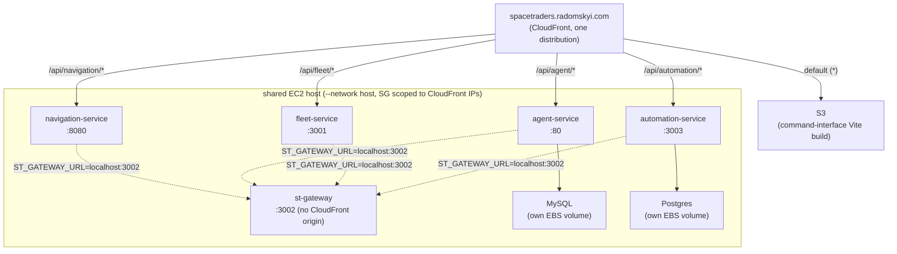

# Operations

How to run the system locally and how it deploys to production. For what the
services do, see [architecture.md](architecture.md).

## Running locally

All repos are checked out as siblings:

```
spacetraders/
├── navigation-service/
├── agent-service/
├── fleet-service/
├── st-gateway/
├── automation-service/
├── ai-service/
├── command-interface/
├── spacetraders-mcp-server/
└── meta/            ← this repo
```

Copy `.env.example` to `.env` (same directory as `docker-compose.yml`) and
fill in `MINING_SHIP_SYMBOL` and `OPENAI_API_KEY` — both are required by
automation-service/ai-service respectively, with no sensible compose-level
default. Compose loads `.env` automatically.

From `meta/`:

```bash
docker compose up --build
```

Starts:

| Service | Port | Storage |
|---|---|---|
| st-gateway | 3002 | none |
| agent-service | 8080 | MySQL (container) |
| navigation-service | 8081 | SQLite |
| fleet-service | 3001 | none |
| automation-service | 3003 | Postgres (container) |
| ai-service | 3004 | none (in-memory dedupe state) |

The frontend runs separately: `npm run dev` in `command-interface/` serves
http://localhost:3000, pinned to match the backends' default CORS origin.

Each backend exposes its own Swagger UI:

- navigation-service: http://localhost:8081/swagger-ui.html
- agent-service: http://localhost:8080/swagger/index.html
- fleet-service: http://localhost:3001/api/fleet/swagger

## Production deployment

Live at [spacetraders.radomskyi.com](https://spacetraders.radomskyi.com)
behind a single CloudFront distribution:



ai-service is **not deployed anywhere** — see the "Deployment gaps" note
below.

- **Backend hosting**: `V-M-Pioneer-Trading/infrastructure` — one Terraform
  stack per service, each SSM-bootstrapped onto the shared EC2 host. Not a
  strict 1:1: st-gateway has no Terraform stack of its own — it's bootstrapped
  as a second `docker run` inside **agent-service's** stack
  (`agent-service/main.tf`), because it was added after agent-service's
  stack already existed and nothing has moved it since. Its port
  (`var.gateway_port`, 3002) and image are agent-service variables, not a
  standalone project.
- **Frontend hosting + routing**: `mradomsky/infrastructure` —
  `projects/spacetraders/` stack (S3 + CloudFront + ACM + Route53).
- **Images**: GHCR, public for all backends — no registry auth needed to pull.
- **Shared bootstrap docs restart colocated containers.** Redeploying a
  service means re-running its SSM bootstrap document, and the whole
  `docker run` script for every container that document owns executes again
  — not just the container that changed. Because st-gateway rides
  agent-service's document, pushing a st-gateway image update also does
  `docker rm -f agent-service-mysql && docker run ...` for agent-service's
  MySQL (briefly restarts it). The reverse is already true today: every
  agent-service deploy already restarts st-gateway as a side effect.
- **Security group ports 80–8080 are open to CloudFront's IP prefix list as
  a single range**, not one rule per service — a per-service rule would have
  exceeded the account's rules-per-security-group quota (that quota counts a
  prefix-list rule by the list's entry count, ~45, not as a flat 1). Any new
  backend service that lands in that range needs no new security-group
  change; anything outside it does.
- **st-gateway has no CloudFront origin** — internal-only by design, it's
  only ever called server-to-server (every other backend's
  `ST_GATEWAY_URL=http://localhost:3002`) as "the only door to SpaceTraders."
  It is reachable from the browser in production today, though: its port
  falls inside the shared 80–8080 security-group range, so nothing at the
  network layer blocks it — CloudFront simply has no route configured for it.

### Deployment gaps

- **ai-service is not deployed.** No Terraform project exists for it (unlike
  every other backend) and its repo has no `.github/workflows` at all — it
  only runs via `docker compose` locally. Deploying it needs: a new Terraform
  stack (mirroring `agent-service/`'s shape — SSM bootstrap doc, EC2 host
  data source, outputs), a new CI workflow (test + build/push + SSM trigger),
  and a real `OPENAI_API_KEY` (see `configFromEnv()` in
  `ai-service/src/config.ts` — the process refuses to start without it).
- **`ANOMALY_WEBHOOK_URL` is unset in production.** automation-service reads
  it via `config.anomalyWebhookUrl` (`automation-service/src/config.ts`,
  defaults to `null`) and only delivers anomaly webhooks
  (`WebhookDelivery`, `automation-service/src/server.ts`) when it's set.
  Nothing sets it in `automation-service/main.tf`'s bootstrap script today,
  so even once ai-service is deployed, the anomaly → AI-supervisor pipeline
  described in ai-service's README stays dark until this is added too.

### Health-check routing

Every backend exposes a bare, unauthenticated `GET /health` for local
dev/compose, *and* the same handler again at `/api/<service>/health` — still
unversioned (no `/v1`), but scoped like the rest of the service's API surface.
The second path exists because CloudFront routes multiple backend origins off
one shared production domain by path pattern; a bare `/health` request from
the browser would either collide across services (every service resolving to
the same origin-relative URL) or hit no configured pattern at all and fall
through to the SPA's `index.html` — a false-positive 200 that looks like a
passing health check regardless of whether the backend is actually up.

command-interface's `SystemStatus` panel (`src/api/healthService.js`) polls
`/api/<service>/health` directly from the browser, once per monitored
service, unauthenticated, before and after login — see `MONITORED_SERVICES`
for the exact path per service. CloudFront
(`mradomsky/infrastructure`, `projects/spacetraders/main.tf`) has a matching
`ordered_cache_behavior` for `/api/<service>/health` alongside the existing
`/api/<service>/v1/*` pattern, for each of navigation-service, agent-service,
fleet-service, automation-service, and st-gateway (`/api/st-gateway/health`
— note st-gateway itself has no `/v1` pattern, since it isn't versioned the
way the others are).

ai-service stays in `MONITORED_SERVICES` but has no production URL to point
at — it isn't deployed (see "Deployment gaps" above) — so its dot always
reads "down" in production, correctly if misleadingly: there's nothing
running to be up.

## CI and deploys

Every service's CI job set is split the same way: a `test` job runs on pull
requests (the service's real test suite — no image build), and a `docker` job
runs only on merge to main (build, push to GHCR, then trigger an SSM redeploy
on the host). command-interface deploys via S3 sync plus CloudFront
invalidation instead, on the same merge-to-main trigger.

One exception: **ai-service has no CI workflow at all** — see "Deployment
gaps" above.

st-gateway's `docker` job triggers **agent-service's** SSM document (it has
no Terraform stack of its own — see "Backend hosting" above), which means a
st-gateway deploy also restarts agent-service's MySQL container as a side
effect (see the shared-bootstrap-doc note above).

## Testing philosophy

One seam per service, at the outermost boundary: tests drive the service's
real HTTP API with in-process stub servers standing in for its dependencies,
and assert observable behavior only. See
[architecture.md](architecture.md#testing-one-seam-per-service) for the
rationale. automation-service's suite runs against a real Postgres (started
via a one-line `docker run`, see its README) with an injectable clock.
