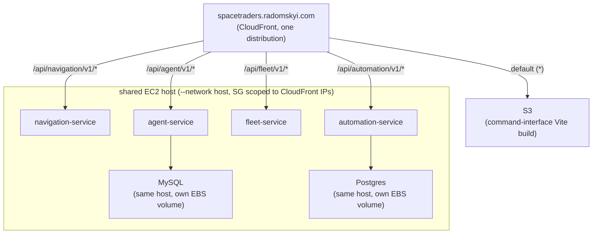

# Operations

How to run the system locally and how it deploys to production. For what the
services do, see [architecture.md](architecture.md).

## Running locally

All repos are checked out as siblings:

```
spacetraders/
├── navigation-service/
├── agent-service/
├── fleet-service/
├── st-gateway/
├── automation-service/
├── ai-service/
├── command-interface/
├── spacetraders-mcp-server/
└── meta/            ← this repo
```

Copy `.env.example` to `.env` (same directory as `docker-compose.yml`) and
fill in `MINING_SHIP_SYMBOL` and `OPENAI_API_KEY` — both are required by
automation-service/ai-service respectively, with no sensible compose-level
default. Compose loads `.env` automatically.

From `meta/`:

```bash
docker compose up --build
```

Starts:

| Service | Port | Storage |
|---|---|---|
| st-gateway | 3002 | none |
| agent-service | 8080 | MySQL (container) |
| navigation-service | 8081 | SQLite |
| fleet-service | 3001 | none |
| automation-service | 3003 | Postgres (container) |
| ai-service | 3004 | none (in-memory dedupe state) |

The frontend runs separately: `npm run dev` in `command-interface/` serves
http://localhost:3000, pinned to match the backends' default CORS origin.

Each backend exposes its own Swagger UI:

- navigation-service: http://localhost:8081/swagger-ui.html
- agent-service: http://localhost:8080/swagger/index.html
- fleet-service: http://localhost:3001/api/fleet/swagger

## Production deployment

Live at [spacetraders.radomskyi.com](https://spacetraders.radomskyi.com)
behind a single CloudFront distribution. Every backend service self-mounts
under a consistent `/api/<service>/v1` prefix:



- **Backend hosting**: `V-M-Pioneer-Trading/infrastructure` — one Terraform
  stack per service, each SSM-bootstrapped onto the shared EC2 host.
- **Frontend hosting + routing**: `mradomsky/infrastructure` —
  `projects/spacetraders/` stack (S3 + CloudFront + ACM + Route53).
- **Images**: GHCR, public for all backends — no registry auth needed to pull.

## CI and deploys

Every service auto-deploys on merge to main: CI builds and pushes the
container image, then triggers an SSM redeploy on the host. command-interface
deploys via S3 sync plus CloudFront invalidation. Pull requests build the
image for verification without pushing.

## Testing philosophy

One seam per service, at the outermost boundary: tests drive the service's
real HTTP API with in-process stub servers standing in for its dependencies,
and assert observable behavior only. See
[architecture.md](architecture.md#testing-one-seam-per-service) for the
rationale. automation-service's suite runs against a real Postgres (started
via a one-line `docker run`, see its README) with an injectable clock.
