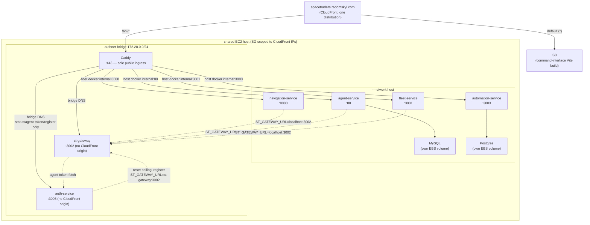

# Operations

How to run the system locally and how it deploys to production. For what the
services do, see [architecture.md](architecture.md).

## Running locally

All repos are checked out as siblings:

```
spacetraders/
├── navigation-service/
├── agent-service/
├── fleet-service/
├── st-gateway/
├── auth-service/
├── automation-service/
├── ai-service/
├── command-interface/
├── spacetraders-mcp-server/
├── V-M-Pioneer-Trading_infrastructure/   ← backend Terraform, not run locally
├── spacetraders-api-docs/                ← the game's own OpenAPI spec
└── meta/            ← this repo
```

Copy `.env.example` to `.env` (same directory as `docker-compose.yml`) and
fill in `MINING_SHIP_SYMBOL` and `OPENAI_API_KEY` — both are required by
automation-service/ai-service respectively, with no sensible compose-level
default. Compose loads `.env` automatically.

From `meta/`:

```bash
docker compose up --build
```

Starts:

| Service | Port | Storage |
|---|---|---|
| st-gateway | 3002 | none |
| agent-service | 8080 | MySQL (container) |
| navigation-service | 8081 | SQLite |
| auth-service | 8082 | SQLite |
| fleet-service | 3001 | none |
| automation-service | 3003 | Postgres (container) |
| ai-service | 3004 | none (in-memory dedupe state) |

The frontend runs separately: `npm run dev` in `command-interface/` serves
http://localhost:3000, pinned to match the backends' default CORS origin.

Two failure modes here look identical from the browser — a bare
`Failed to fetch` on login, with health checks still green, because health
checks are unauthenticated and skip both problems:

- **A backend not allowing `Authorization` through CORS.** The dashboard sends
  the operator's Clerk session as `Authorization` on every call; the browser
  preflights it, and a service that doesn't list it in
  `Access-Control-Allow-Headers` gets every authenticated request blocked.
  Confirm with:
  ```
  curl -X OPTIONS http://localhost:8080/api/agent/v1/agent \
    -H 'Origin: http://localhost:3000' \
    -H 'Access-Control-Request-Method: GET' \
    -H 'Access-Control-Request-Headers: authorization' -D -
  ```
  The response must echo `Authorization` in `Access-Control-Allow-Headers`.
  (`X-Priority` and `X-SpaceTraders-Token` are gone — a backend still
  allow-listing them is harmless, one requiring them is a bug.)
- **A stale `command-interface/.env.local`.** It's gitignored, so it doesn't
  follow changes to the service base paths. Every `VITE_*_SERVICE_URL` must
  include the versioned prefix (`http://localhost:8080/api/agent/v1`, not
  `http://localhost:8080`). Compare against `.env.example`, or just delete the
  file — the defaults already match this compose setup.

One production-only trap that looks like neither: **CloudFront serves
`index.html` with a 200 for any path its origins 404.** That is ordinary
single-page-app fallback, but it means a backend route that does not exist
reaches the browser as the dashboard, not as a 404 — so a missing or
conditionally-registered route reads as a working page. It is how anomaly
detection stayed switched off in production unnoticed: `GET
/api/automation/v1/anomalies/digest` returned the dashboard HTML rather than
anything that looked wrong.

When checking whether a production route exists, check the content type, and
compare against a path you know is absent:

```
curl -s -o /dev/null -w '%{http_code} %{content_type}\n' \
  https://spacetraders.radomskyi.com/api/automation/v1/anomalies/digest
curl -s -o /dev/null -w '%{http_code} %{content_type}\n' \
  https://spacetraders.radomskyi.com/api/automation/v1/definitely-not-a-route
```

A real route answers `application/json`; a missing one answers `text/html` with
the same 200.

Curling an authenticated route needs a token. Locally, every backend that
verifies a Clerk session checks it against the committed development keypair in
`dev-keys/`, which compose mounts into each of them, and
`node scripts/mint-dev-token.mjs` signs a token against its private half. That is
every backend but ai-service, which verifies nothing and gets no mount. The one
alternative is setting `CLERK_JWT_KEY` in `.env` to a real Clerk instance's
public key, which overrides the mounted file and means signing in for real. See
[dev-keys/README.md](../dev-keys/README.md) for why that key is committed, why
it is safe, and how to narrow the scopes it carries.

Each backend exposes its own Swagger UI:

- navigation-service: http://localhost:8081/swagger-ui.html
- agent-service: http://localhost:8080/swagger/index.html
- fleet-service: http://localhost:3001/api/fleet/swagger

## Production deployment

Live at [spacetraders.radomskyi.com](https://spacetraders.radomskyi.com)
behind a single CloudFront distribution. Every backend service self-mounts
under a consistent `/api/<service>/v1` prefix:



**Two network modes, not one.** Four services plus both databases still run
`--network host`; Caddy, st-gateway and auth-service sit on the private
`authnet` bridge (auth-design decision 9). The seam between them is deliberate
and asymmetric:

- st-gateway publishes `-p 127.0.0.1:3002:3002`, so the three host-network
  services that call it (navigation-, agent- and fleet-service) reach it at the
  same `localhost:3002` they always used — no change was needed in any of
  them. automation-service, the fourth, never calls the gateway at all.
- Caddy, being on the bridge, cannot use `localhost` to reach the four
  host-network services — inside a bridged container that means the container
  itself. It uses `host.docker.internal` (via `--add-host
  host.docker.internal:host-gateway`) for those, and ordinary bridge DNS for
  its two `authnet` peers.
- auth-service is firewalled to `authnet` sources only, and publishes no host
  port — with one change pending, below.

*Note, 2026-09-21 —
[infrastructure#86](https://github.com/V-M-Pioneer-Trading/infrastructure/pull/86)
(meta#80 step 3) publishes auth-service's port as `-p 127.0.0.1:3005:3005` —
loopback only, so it is still on no external interface — and adds one `RETURN`
to `authnet-out-guard` before its `DROP`, so the four `--network host` services
can call `POST /auth/v1/introspect` at `http://localhost:3005`. It is the same
shape st-gateway already uses. `auth-service-authnet-guard` is untouched, and
no security-group or CloudFront change is involved. **`terraform apply` on that
stack is manual**, so merging the PR does not change the host: until the apply
auth-service publishes nothing, afterwards it publishes on loopback only. Check
the host (`docker port auth-service`, `iptables -S authnet-out-guard`) rather
than assuming either state.*

ai-service is **not deployed anywhere** — see the "Deployment gaps" note
below.

- **Backend hosting**: `V-M-Pioneer-Trading/infrastructure` — one Terraform
  stack per service, each SSM-bootstrapped onto the shared EC2 host. Not a
  strict 1:1: st-gateway has no Terraform stack of its own — it's bootstrapped
  as a second `docker run` inside **agent-service's** stack
  (`agent-service/main.tf`), because it was added after agent-service's
  stack already existed and nothing has moved it since. Its port
  (`var.gateway_port`, 3002) and image are agent-service variables, not a
  standalone project.
- **Frontend hosting + routing**: `mradomsky/infrastructure` —
  `projects/spacetraders/` stack (S3 + CloudFront + ACM + Route53).
- **Images**: GHCR, public for all backends — no registry auth needed to pull.
- **Shared bootstrap docs restart colocated containers.** Redeploying a
  service means re-running its SSM bootstrap document, and the whole
  `docker run` script for every container that document owns executes again
  — not just the container that changed. Because st-gateway rides
  agent-service's document, pushing a st-gateway image update also does
  `docker rm -f agent-service-mysql && docker run ...` for agent-service's
  MySQL (briefly restarts it). The reverse is already true today: every
  agent-service deploy already restarts st-gateway as a side effect.
- **The security group admits port 443 only**, from CloudFront's IP prefix
  list, to Caddy — a single rule, and the only ingress rule in the
  infrastructure repo (`navigation-service/main.tf`). No backend port is
  reachable from off-host at all, so a new service needs no security-group
  change whatever port it picks. It used to be a single 80–8080 range rather
  than one rule per service, because a prefix-list rule counts against the
  rules-per-security-group quota by the list's entry count (~45) rather than
  as a flat 1, and per-service rules would have exceeded it. That span is
  gone; the quota is why the replacement is still one rule rather than
  several.
- **st-gateway has no CloudFront origin** — internal-only by design, it's
  only ever called server-to-server (navigation-, agent- and fleet-service at
  `ST_GATEWAY_URL=http://localhost:3002`, auth-service over the bridge at
  `http://st-gateway:3002`; automation-service never calls it) as "the only door to SpaceTraders."
  It was browser-reachable in production until the `authnet` move: its port
  fell inside the old 80–8080 range, so nothing at the network layer blocked
  it. It now publishes on `127.0.0.1` only, and the range that exposed it no
  longer exists, so the gap is closed twice over.

### Deployment gaps

- **ai-service is not deployed.** No Terraform project exists for it (unlike
  every other backend) and its repo has no `.github/workflows` at all — it
  only runs via `docker compose` locally. Deploying it needs: a new Terraform
  stack (mirroring `agent-service/`'s shape — SSM bootstrap doc, EC2 host
  data source, outputs), a new CI workflow (test + build/push + SSM trigger),
  and a real `OPENAI_API_KEY` (see `configFromEnv()` in
  `ai-service/src/config.ts` — the process refuses to start without it).
- **`ANOMALY_WEBHOOK_URL` is unset in production.** automation-service reads
  it via `config.anomalyWebhookUrl` (`automation-service/src/config.ts`,
  defaults to `null`) and only delivers anomaly webhooks
  (`WebhookDelivery`, `automation-service/src/server.ts`) when it's set.
  Nothing sets it in `automation-service/main.tf`'s bootstrap script today,
  so even once ai-service is deployed, the anomaly → AI-supervisor pipeline
  described in ai-service's README stays dark until this is added too.

### Health-check routing

Every backend exposes a bare, unauthenticated `GET /health` for local
dev/compose, *and* the same handler again at `/api/<service>/health` — still
unversioned (no `/v1`), but scoped like the rest of the service's API surface.
The second path exists because CloudFront routes multiple backend origins off
one shared production domain by path pattern; a bare `/health` request from
the browser would either collide across services (every service resolving to
the same origin-relative URL) or hit no configured pattern at all and fall
through to the SPA's `index.html` — a false-positive 200 that looks like a
passing health check regardless of whether the backend is actually up.

command-interface's `SystemStatus` panel (`src/api/healthService.js`) polls
`/api/<service>/health` directly from the browser, once per monitored
service, unauthenticated, before and after login — see `SERVICE_DEFINITIONS`
for the exact path per service. CloudFront
(`mradomsky/infrastructure`, `projects/spacetraders/main.tf`) has a matching
`ordered_cache_behavior` for `/api/<service>/health` alongside the existing
`/api/<service>/v1/*` pattern, for each of navigation-service, agent-service,
fleet-service, automation-service, and st-gateway (`/api/st-gateway/health`
— note st-gateway itself has no `/v1` pattern, since it isn't versioned the
way the others are).

ai-service is in `SERVICE_DEFINITIONS` but has no production URL to point at —
it isn't deployed (see "Deployment gaps" above). `probeableServices` drops any
service an HTTPS page cannot address, and ai-service's `http://localhost`
default is one, so in production it is not listed at all rather than shown as
down. `MONITORED_SERVICES` is the list after that filter. auth-service is not
in `SERVICE_DEFINITIONS` yet.

## CI and deploys

Every service's CI job set is split the same way: a `test` job runs the
service's real test suite on pull requests **and** on pushes to main, and a
`docker` job never runs for a pull request (build, push to GHCR, then trigger
an SSM redeploy on the host) and `needs` the test job, so a merge whose tests
fail deploys nothing. For most services that means a push; st-gateway's
`docker` job and command-interface's `deploy` job also run on a manual
`workflow_dispatch`, still behind the test job. command-interface deploys via
S3 sync plus CloudFront invalidation instead, behind the same gate, with both
jobs on the same Node version and both installing with `npm ci`. agent-service
adds a third, pull-request-only `image` job that builds the Dockerfile without
pushing, so a broken image is found before the merge rather than mid-deploy.

Both halves of that are corrections. The `test` job used to be gated to
`pull_request`, so a merge to main went straight to build-and-deploy with no
suite run against what was actually being deployed; and the `docker` job did not
`need` it, so nothing was waiting on a test result even where one existed. The
`pull_request` trigger also carries no branch filter now, because filtering it
to main meant a pull request stacked on another branch ran no checks at all and
looked green by default.

Deploy permissions are a third correction, found by review of the first two.
`packages: write` and `id-token: write` are declared on the deploy job, never at
workflow level. The deploy role trusts the `refs/heads/main` subject alone, and
the test job now runs on exactly that ref: with workflow-level permissions,
dependency install scripts and test code could have assumed the role that
re-runs the production bootstrap documents.

One exception: **ai-service has no CI workflow at all** — see "Deployment
gaps" above.

st-gateway's `docker` job triggers **agent-service's** SSM document (it has
no Terraform stack of its own — see "Backend hosting" above), which means a
st-gateway deploy also restarts agent-service's MySQL container as a side
effect (see the shared-bootstrap-doc note above).

## Testing philosophy

One seam per service, at the outermost boundary: tests drive the service's
real HTTP API with in-process stub servers standing in for its dependencies,
and assert observable behavior only. See
[architecture.md](architecture.md#testing-one-seam-per-service) for the
rationale. automation-service's suite runs against a real Postgres (started
via a one-line `docker run`, see its README) with an injectable clock.

The one deliberate exception is automation-service's scoring model
(`src/scoring.ts`), which is unit-tested directly — it's pure arithmetic with
no I/O, it's the part most worth being certain about, and reaching it only
through HTTP would mean constructing a fleet to assert a multiplication.

## Tuning the autopilot

Knobs are edited through the dashboard's Knobs panel or
`PUT /api/automation/v1/planner/knobs/:name`, and they're grouped into three
classes — `policy` (yours to tune), `alert` (operator-only thresholds), and
`model` (values the fleet measures for itself). See
[automation-service's README](https://github.com/V-M-Pioneer-Trading/automation-service#knobs).

Before changing a knob in production, replay it against what the fleet has
already decided:

```bash
npm run replay -- --since 6h --set mine.taskWeight=2
```

It needs `DATABASE_URL` pointing at automation-service's Postgres and makes no
network calls of its own. What it re-scores, what it deliberately doesn't, and
how to read the result are in
[algorithms.md](algorithms.md#shadow-mode-and-replay).
